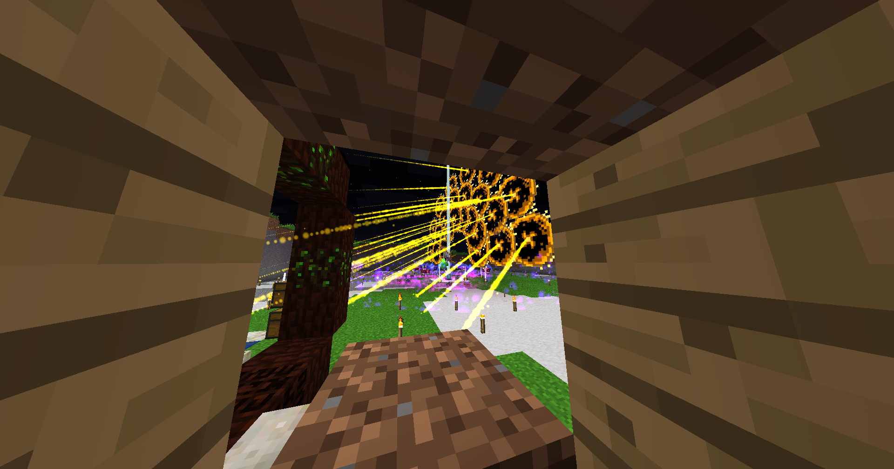
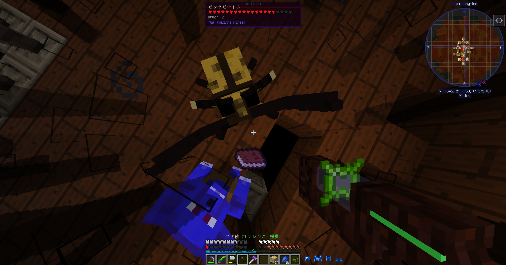

Mod Season 1 | Minecraft Forge 1.12.2 | 2022/03/01 ～ 2022/03/05

# Mod の世界

Java 版を持っているマインクラフターのみんな、

今まで見たことのないブロックやアイテムが追加される Mod の世界で遊んでみないか？

## Mods リスト

| Mod 名                                    | バージョン                     | Mod のファイル名                              |
| ----------------------------------------- | ------------------------------ | --------------------------------------------- |
| AI Improvements                           | 1.12-0.0.1b3                   | AIImprovements-1.12-0.0.1b3.jar               |
| AppleCore                                 | mc1.12.2-3.4.0                 | AppleCore-mc1.12.2-3.4.0.jar                  |
| AppleSkin                                 | mc1.12-1.0.14                  | AppleSkin-mc1.12-1.0.14.jar                   |
| AttributeFix                              | 1.12.2-1.0.4                   | AttributeFix-1.12.2-1.0.4.jar                 |
| AutoRegLib                                | 1.3-32                         | AutoRegLib-1.3-32.jar                         |
| Bad Wither No Cookie - Reloaded           | 1.12.2-3.4.18                  | badwithernocookiereloaded-1.12.2-3.4.18.jar   |
| Baubles                                   | 1.12-1.5.2                     | Baubles-1.12-1.5.2.jar                        |
| Botania                                   | r1.10-364.4                    | Botania r1.10-364.4.jar                       |
| Chisel                                    | MC1.12.2-1.0.2.45              | Chisel-MC1.12.2-1.0.2.45.jar                  |
| Client Tweaks                             | 1.12.2-3.1.11                  | ClientTweaks_1.12.2-3.1.11.jar                |
| Clumps                                    | 3.1.2                          | Clumps-3.1.2.jar                              |
| ConnectedMod                              | MC1.12.2-1.0.2.31              | CTM-MC1.12.2-1.0.2.31.jar                     |
| Controlling                               | 3.0.10                         | Controlling-3.0.10.jar                        |
| Cosmetic Armor Reworked                   | 1.12.2-v5a                     | CosmeticArmorReworked-1.12.2-v5a.jar          |
| Crafting Tweaks                           | 1.12.2-8.1.9                   | CraftingTweaks_1.12.2-8.1.9.jar               |
| CraftTweaker                              | 1.12-4.1.20.674                | CraftTweaker2-1.12-4.1.20.674.jar             |
| Enchantment Descriptions                  | 1.12.2-1.1.15                  | EnchantmentDescriptions-1.12.2-1.1.15.jar     |
| ExtraBotany                               | r1.1-58r                       | ExtraBotany-r1.1-58r.jar                      |
| Fast Leaf Decay                           | v14                            | FastLeafDecay-v14.jar                         |
| Faster Ladder Climbing                    | 1.12-0.1-146                   | FasterLadderClimbing-1.12-0.1-146.jar         |
| FastFurnace                               | 1.12.2-1.3.1                   | FastFurnace-1.12.2-1.3.1.jar                  |
| FastWorkbench                             | 1.12.2-1.7.3                   | FastWorkbench-1.12.2-1.7.3.jar                |
| Foam​Fix                                  | 0.10.14-1.12.2                 | foamfix-0.10.14-1.12.2.jar                    |
| FTB Library (Forge) (Legacy)              | 5.4.7.2                        | FTBLib-5.4.7.2.jar                            |
| FTB Utilities (Forge)                     | 5.4.1.131                      | FTBUtilities-5.4.1.131.jar                    |
| GraveStone Mod                            | 1.10.3                         | gravestone-1.10.3.jar                         |
| Hwyla                                     | 1.8.26-B41_1.12.2              | Hwyla-1.8.26-B41_1.12.2.jar                   |
| Inventory Tweaks 1.12 only]               | 1.63                           | InventoryTweaks-1.63.jar                      |
| JEI Integration                           | 1.12.2-4.16.1.301              | jei_1.12.2-4.16.1.301.jar                     |
| JourneyMap                                | 1.12.2-5.7.1                   | journeymap-1.12.2-5.7.1.jar                   |
| Just Enough Items (JEI)                   | 1.12.2-1.6.0                   | jeiintegration_1.12.2-1.6.0.jar               |
| Just Enough Resources (JER)               | 1.12.2-0.9.2.60                | JustEnoughResources-1.12.2-0.9.2.60.jar       |
| Mantle                                    | 1.12-1.3.3.55                  | Mantle-1.12-1.3.3.55.jar                      |
| Morpheus                                  | 1.12.2-3.5.106                 | Morpheus-1.12.2-3.5.106.jar                   |
| Mouse Tweaks                              | 2.10-mc1.12.2                  | MouseTweaks-2.10-mc1.12.2.jar                 |
| Neat                                      | 1.4-17                         | Neat 1.4-17.jar                               |
| No Recipe Book                            | v1.2.2formc1.12.2              | noRecipeBook_v1.2.2formc1.12.2.jar            |
| Phosphor (Forge)                          | 1.12.2-0.2.6+build50-universal | phosphor-1.12.2-0.2.6+build50-universal.jar   |
| Placebo                                   | 1.12.2-1.6.0                   | Placebo-1.12.2-1.6.0.jar                      |
| Quark                                     | r1.6-179                       | Quark-r1.6-179.jar                            |
| RandomPatches (Forge)                     | 1.12.2-1.22.1.10               | randompatches-1.12.2-1.22.1.10.jar            |
| Simple Storage Network                    | 1.12.2-1.8.3                   | SimpleStorageNetwork-1.12.2-1.8.3.jar         |
| Surge                                     | 1.12.2-2.0.77                  | Surge-1.12.2-2.0.77.jar                       |
| SwingThroughGrass                         | 1.12.2-1.2.3                   | stg-1.12.2-1.2.3.jar                          |
| The Twilight Forest                       | 1.12.2-3.11.1021-universal     | twilightforest-1.12.2-3.11.1021-universal.jar |
| Tinkers Construct                         | 1.12.2-2.13.0.183              | TConstruct-1.12.2-2.13.0.183.jar              |
| Tinkers' Tool Leveling                    | 1.12.2-1.1.0                   | TinkerToolLeveling-1.12.2-1.1.0.jar           |
| Toast Control                             | 1.12.2-1.8.1                   | Toast Control-1.12.2-1.8.1.jar                |
| Torchmaster                               | 1.12.2-1.8.5.0                 | torchmaster_1.12.2-1.8.5.0.jar                |
| Waila Harvestability                      | mc1.12-1.1.12                  | WailaHarvestability-mc1.12-1.1.12.jar         |
| Wawla - What Are We Looking At            | 1.12.2-2.6.275                 | Wawla-1.12.2-2.6.275.jar                      |
| Waystones                                 | 1.12.2-4.1.0                   | Waystones_1.12.2-4.1.0.jar                    |
| Yet Another Recipe Conflict Fixer (YARCF) | 0.14(1.12.2)                   | YARCF-0.14(1.12.2).jar                        |

## スクリーンショット

