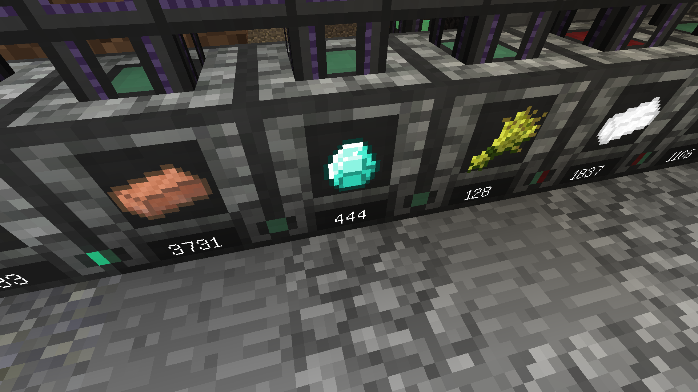
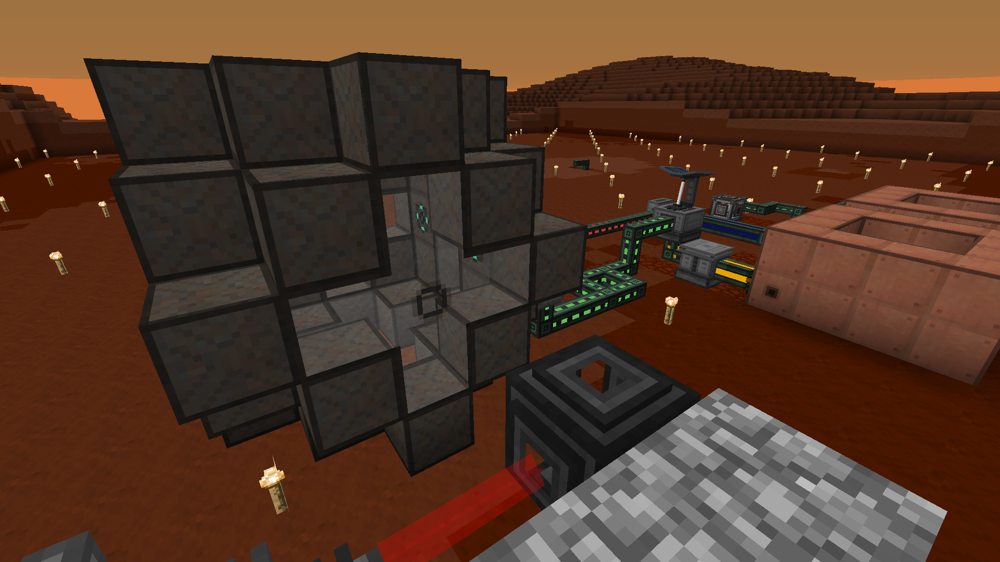
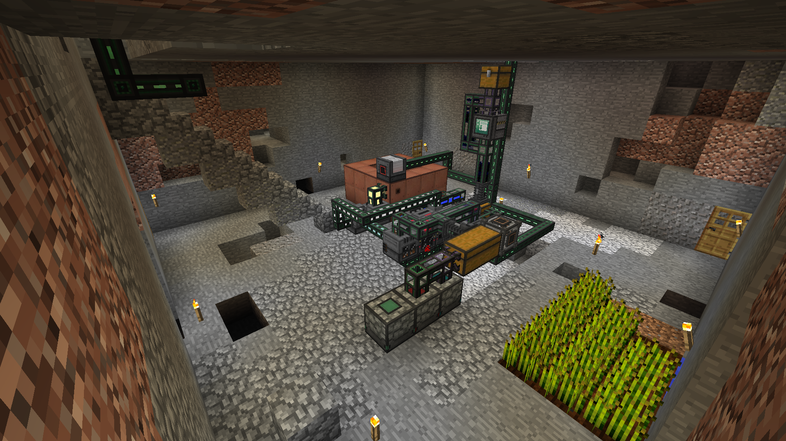
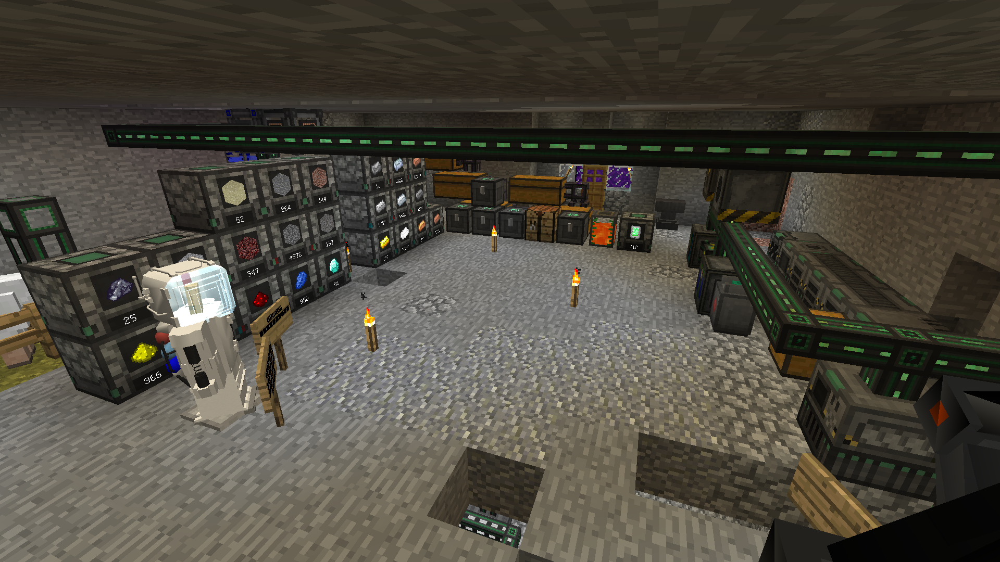
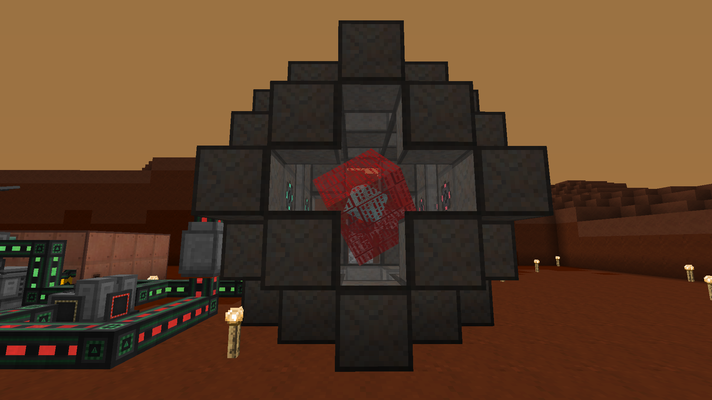

Mod Season 2 | Minecraft Forge 1.12.2 | 2022/03/15 ～ 2022/03/18

# 宇宙 & 工業 ― Galacticraft & Mekanism

宇宙、工業をメインにみんなでやっていきます！！！

## Mods リスト

| Mod 名               | バージョン       | Mod のファイル名                          |
| -------------------- | ---------------- | ----------------------------------------- |
| GalacticraftCore     | 1.12.2-4.0.2.280 | GalacticraftCore-1.12.2-4.0.2.280.jar     |
| Galacticraft-Planets | 1.12.2-4.0.2.280 | Galacticraft-Planets-1.12.2-4.0.2.280.jar |
| MicdoodleCore        | 1.12.2-4.0.2.280 | MicdoodleCore-1.12.2-4.0.2.280.jar        |
| ExtraPlanets         | 1.12.2-0.7.4     | ExtraPlanets-1.12.2-0.7.4.jar             |
| MJRLegends Lib       | 1.12.2-1.2.1     | MJRLegendsLib-1.12.2-1.2.1.jar            |
| Mekanism             | 1.12.2-9.8.3.390 | Mekanism-1.12.2-9.8.3.390.jar             |
| Mekanism Generators  | 1.12.2-9.8.3.390 | MekanismGenerators-1.12.2-9.8.3.390.jar   |
| Mekanism Tools       | 1.12.2-9.8.3.390 | MekanismTools-1.12.2-9.8.3.390.jar        |
| Mekanism Fluxified   | 1.12.2-1.0.0     | mekanismfluxified-1.12.2-1.0.0.jar        |
| MekanismOres         | 2.0.13           | mekores-2.0.13.jar                        |

## Mod の入れ方

---

### Micdoodle's Dev Hub

Mod 名をクリックしてリンクを踏み、6 秒待って、Download をクリックします。

それぞれの Mod をダウンロードしたら mods フォルダに入れます。

#### Galacticraft

次の 3 つのダウンロードの仕方について説明します。

- [GalacticraftCore](http://micdoodle8.com/download?R2FsYWN0aWNyYWZ0Q29yZS0xLjEyLjItNC4wLjIuMjgwLmphcj9odHRwczovL21pY2Rvb2RsZTguY29tL25ldy1idWlsZHMvR0MtMS4xMi8yODAvR2FsYWN0aWNyYWZ0Q29yZS0xLjEyLjItNC4wLjIuMjgwLmphcj9HQy0xXzEyPzI4MA==)
- [Galacticraft-Planets](https://micdoodle8.com/download?R2FsYWN0aWNyYWZ0LVBsYW5ldHMtMS4xMi4yLTQuMC4yLjI4MC5qYXI/aHR0cHM6Ly9taWNkb29kbGU4LmNvbS9uZXctYnVpbGRzL0dDLTEuMTIvMjgwL0dhbGFjdGljcmFmdC1QbGFuZXRzLTEuMTIuMi00LjAuMi4yODAuamFyP0dDLTFfMTI/Mjgw)
- [MicdoodleCore](http://micdoodle8.com/download?TWljZG9vZGxlQ29yZS0xLjEyLjItNC4wLjIuMjgwLmphcj9odHRwczovL21pY2Rvb2RsZTguY29tL25ldy1idWlsZHMvR0MtMS4xMi8yODAvTWljZG9vZGxlQ29yZS0xLjEyLjItNC4wLjIuMjgwLmphcj9HQy0xXzEyPzI4MA==)

---

### CurseForge

Mod 名をクリックしてリンクを踏み、Download をクリックし、5 秒待つとダウンロードが開始されます。

それぞれの Mod をダウンロードしたら mods フォルダに入れます。

#### Extra Planets

- [ExtraPlanets](https://www.curseforge.com/minecraft/mc-mods/extraplanets/files/3614752)
- [MJRLegends Lib](https://www.curseforge.com/minecraft/mc-mods/mjrlegendslib/files/3344068)

#### Mekanism

- [Mekanism](https://www.curseforge.com/minecraft/mc-mods/mekanism/files/2835175)

#### Addon (Mekanism)

- [Mekanism Generators](https://www.curseforge.com/minecraft/mc-mods/mekanism-generators/files/2835177)
- [Mekanism Tools](https://www.curseforge.com/minecraft/mc-mods/mekanism-tools/files/2835178)
- [Mekanism Fluxified](https://www.curseforge.com/minecraft/mc-mods/mekanism-fluxified/files/3003367)
- [MekanismOres](https://www.curseforge.com/minecraft/mc-mods/mekanismores/files/2884937)

---

## スクリーンショット

