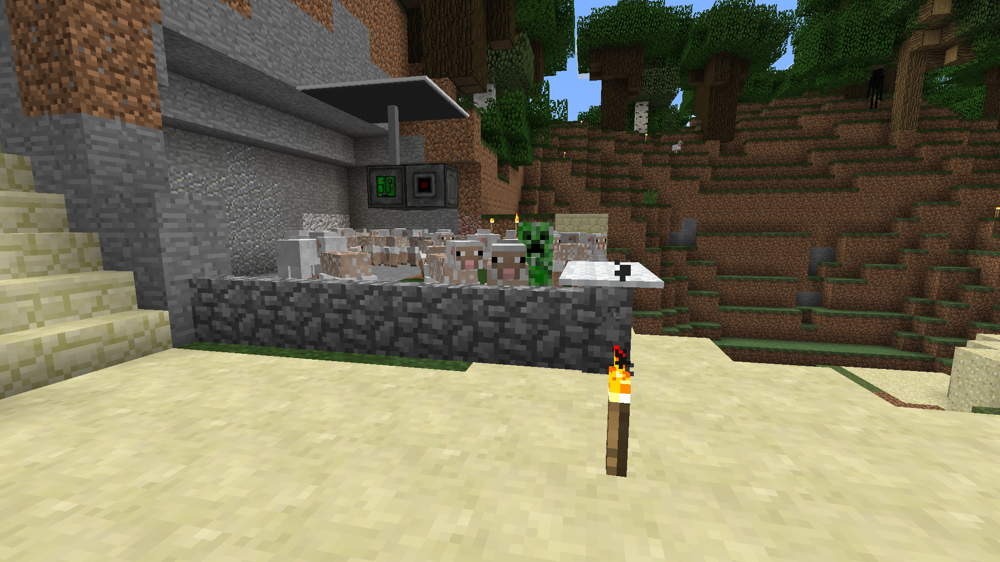
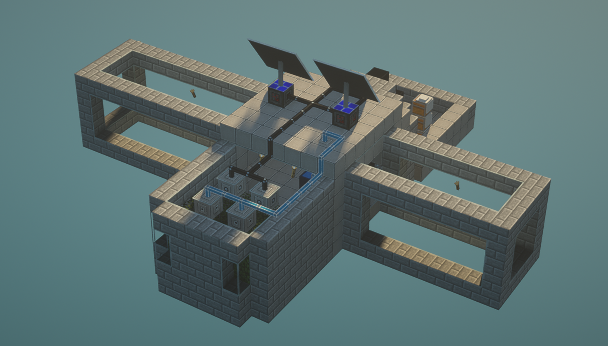
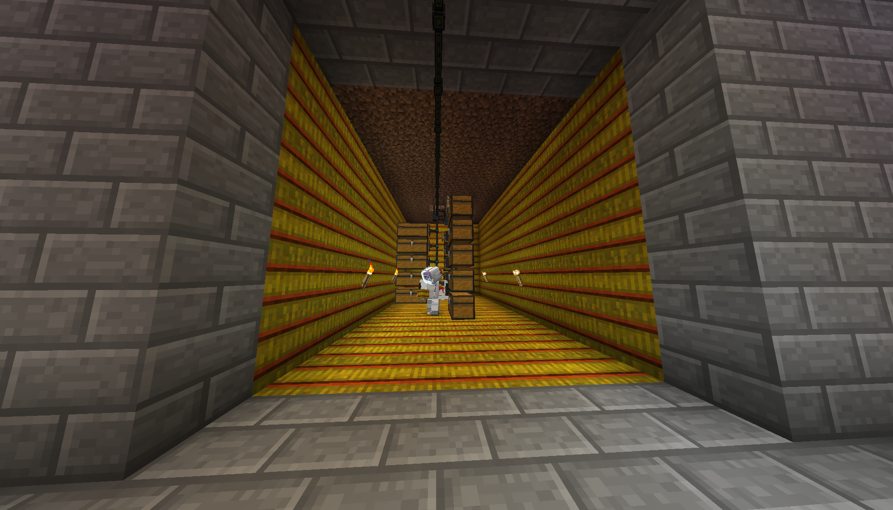
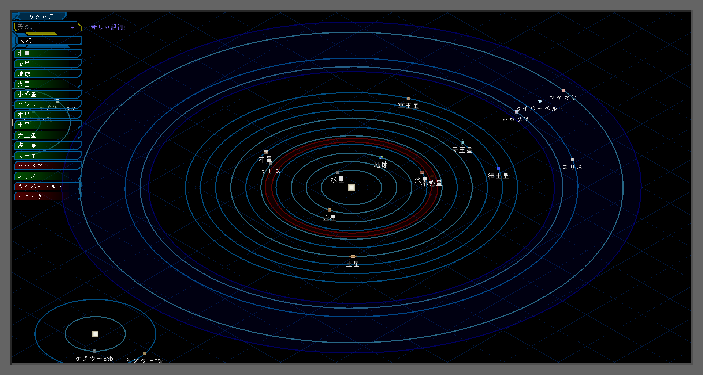
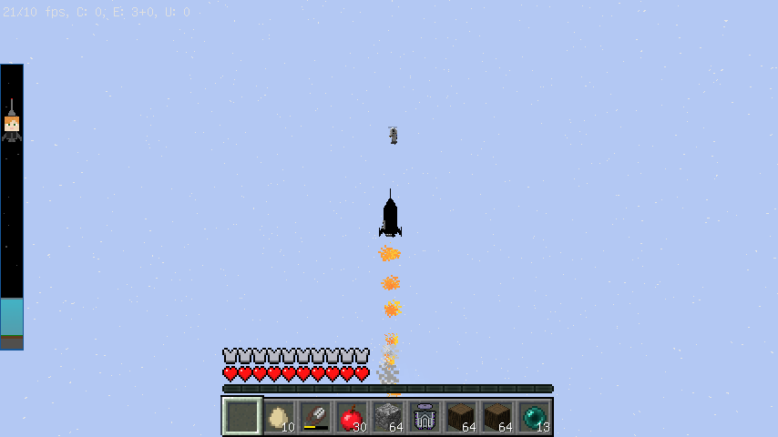

Mod Season 3 | Minecraft Forge 1.12.2 | 2022/03/18 ～ 2022/03/25

# 宇宙 & 工業 ― Galacticraft & EnderIO

宇宙、工業をメインになりますが Mekanism(Mod S2 で遊んだよ～) ではなく EnderIO を導入します！

ちょっとだけ難易度 UP!

## Mods リスト

| Mod 名                  | バージョン       | Mod のファイル名                          |
| ----------------------- | ---------------- | ----------------------------------------- |
| GalacticraftCore        | 1.12.2-4.0.2.280 | GalacticraftCore-1.12.2-4.0.2.280.jar     |
| Galacticraft-Planets    | 1.12.2-4.0.2.280 | Galacticraft-Planets-1.12.2-4.0.2.280.jar |
| MicdoodleCore           | 1.12.2-4.0.2.280 | MicdoodleCore-1.12.2-4.0.2.280.jar        |
| ExtraPlanets            | 1.12.2-0.7.4     | ExtraPlanets-1.12.2-0.7.4.jar             |
| MJRLegends Lib          | 1.12.2-1.2.1     | MJRLegendsLib-1.12.2-1.2.1.jar            |
| Ender IO                | 1.12.2-5.3.70    | EnderIO-1.12.2-5.3.70.jar                 |
| EnderCore               | 1.12.2-0.5.76    | EnderCore-1.12.2-0.5.76.jar               |
| FTB Utilities           | 5.4.1.131        | FTBUtilities-5.4.1.131.jar                |
| FTB Lib                 | 5.4.7.2          | FTBLib-5.4.7.2.jar                        |
| Just Enough Items (JEI) | 1.12.2-9.8.3.390 | jei_1.12.2-4.16.1.301.jar                 |

## Mods の入れ方

---

### Micdoodle's Dev Hub

Mod 名をクリックしてリンクを踏み、6 秒待って、Download をクリックします。

それぞれの Mod をダウンロードしたら mods フォルダに入れます。

#### Galacticraft

次の 3 つのダウンロードの仕方について説明します。

- [GalacticraftCore](http://micdoodle8.com/download?R2FsYWN0aWNyYWZ0Q29yZS0xLjEyLjItNC4wLjIuMjgwLmphcj9odHRwczovL21pY2Rvb2RsZTguY29tL25ldy1idWlsZHMvR0MtMS4xMi8yODAvR2FsYWN0aWNyYWZ0Q29yZS0xLjEyLjItNC4wLjIuMjgwLmphcj9HQy0xXzEyPzI4MA==)
- [Galacticraft-Planets](https://micdoodle8.com/download?R2FsYWN0aWNyYWZ0LVBsYW5ldHMtMS4xMi4yLTQuMC4yLjI4MC5qYXI/aHR0cHM6Ly9taWNkb29kbGU4LmNvbS9uZXctYnVpbGRzL0dDLTEuMTIvMjgwL0dhbGFjdGljcmFmdC1QbGFuZXRzLTEuMTIuMi00LjAuMi4yODAuamFyP0dDLTFfMTI/Mjgw)
- [MicdoodleCore](http://micdoodle8.com/download?TWljZG9vZGxlQ29yZS0xLjEyLjItNC4wLjIuMjgwLmphcj9odHRwczovL21pY2Rvb2RsZTguY29tL25ldy1idWlsZHMvR0MtMS4xMi8yODAvTWljZG9vZGxlQ29yZS0xLjEyLjItNC4wLjIuMjgwLmphcj9HQy0xXzEyPzI4MA==)

---

### CurseForge

Mod 名をクリックしてリンクを踏み、Download をクリックし、5 秒待つとダウンロードが開始されます。

それぞれの Mod をダウンロードしたら mods フォルダに入れます。

#### Extra Planets

- [ExtraPlanets](https://www.curseforge.com/minecraft/mc-mods/extraplanets/files/3614752)
- [MJRLegends Lib](https://www.curseforge.com/minecraft/mc-mods/mjrlegendslib/files/3344068)

#### EnderIO

- [EnderIO](https://www.curseforge.com/minecraft/mc-mods/ender-io/files/3328811)
- [EnderCore](https://www.curseforge.com/minecraft/mc-mods/endercore/files/2972849)

#### FTB Utilities

- [FTB Utilities](https://www.curseforge.com/minecraft/mc-mods/ftb-utilities-forge/files/3157548)
- [FTB Lib](https://www.curseforge.com/minecraft/mc-mods/ftb-library-legacy-forge/files/2985811)

#### Just Enough Items (JEI)

- [Just Enough Items (JEI)](https://www.curseforge.com/minecraft/mc-mods/jei/files/3040523)

---

## スクリーンショット

