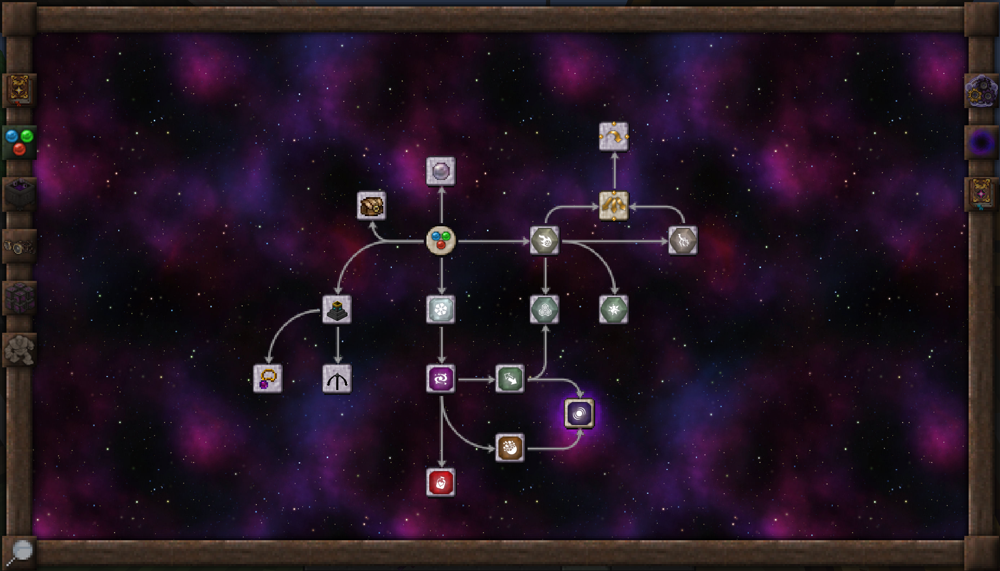
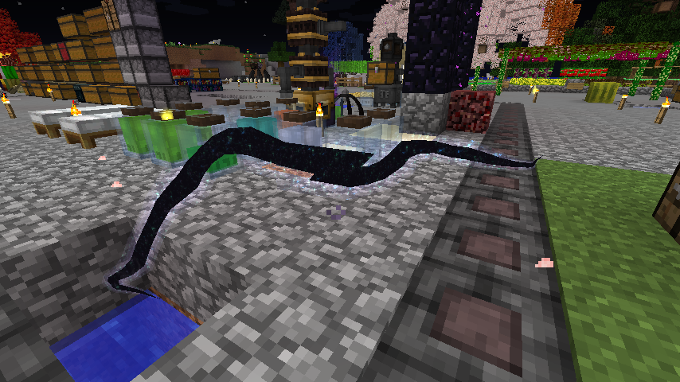
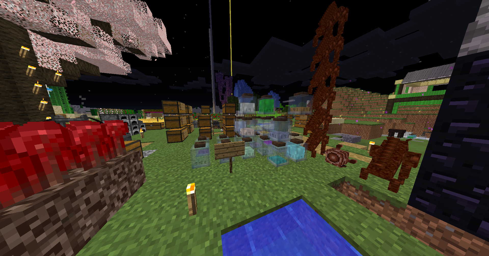

Mod Season 4 | Minecraft Forge 1.12.2 | 2022/03/26 ～ 2022/04/08

# 魔法 & RPG ― Thaumcraft & Divine RPG

魔法 と RPG (戦闘要素多め) をメインに導入します！

戦闘難易度 UP します！！

## Mods リスト

| Mod 名                     | バージョン         | Mod のファイル名                           |
| -------------------------- | ------------------ | ------------------------------------------ |
| Thaumcraft                 | 1.12.2-6.1.BETA26  | Thaumcraft-1.12.2-6.1.BETA26.jar           |
| Baubles                    | 1.12-1.5.2         | Baubles-1.12-1.5.2.jar                     |
| Thaumic Augmentation       | 1.12.2-2.1.5       | ThaumicAugmentation-1.12.2-2.1.5.jar       |
| Thaumic Inventory Scanning | 1.12.2-2.0.10      | ThaumicInventoryScanning_1.12.2-2.0.10.jar |
| Thaumic Periphery          | 0.3.1              | thaumicperiphery-0.3.1.jar                 |
| Thaumic Tinkerer           | 1.12.2 5.0 BETA1.3 | thaumictinkerer-1.12.2-5.0-620a0c5.jar     |
| Divine RPG                 | 1.7.1              | DivineRPG-1.7.1.jar                        |
| Sakura                     | 1.0.7-1.12.2       | Sakura-1.0.7-1.12.2.jar                    |
| Mysterious Mountain Lib    | 2.3.0              | MMLib-2.3.0.jar                            |
| Slash Blade                | 1.12-r33           | SlashBlade-mc1.12-r33.jar                  |
| The Last Smith             | 2.1.8-1.12.2       | TLS-2.1.8-1.12.2.jar                       |
| FTB Utilities              | 5.4.1.131          | FTBUtilities-5.4.1.131.jar                 |
| FTB Lib                    | 5.4.7.2            | FTBLib-5.4.7.2.jar                         |
| Just Enough Items (JEI)    | 1.12.2-9.8.3.390   | jei_1.12.2-4.16.1.301.jar                  |

## Mods の入れ方

---

### CurseForge

Mod 名をクリックしてリンクを踏み、Download をクリックし、5 秒待つとダウンロードが開始されます。

それぞれの Mod をダウンロードしたら mods フォルダに入れます。

#### Thaumcraft

- [Thaumcraft](https://www.curseforge.com/minecraft/mc-mods/thaumcraft/files/2629023)
- [Baubles](https://www.curseforge.com/minecraft/mc-mods/baubles/files)

#### Addon (Thaumcraft)

- [Thaumic Augmentation](https://www.curseforge.com/minecraft/mc-mods/thaumic-augmentation/files)
- [Thaumic Inventory Scanning](https://www.curseforge.com/minecraft/mc-mods/thaumcraft-inventory-scanning/files/2559089)
- [Thaumic Periphery](https://www.curseforge.com/minecraft/mc-mods/thaumic-periphery/files)
- [Thaumic Tinkerer](https://www.curseforge.com/minecraft/mc-mods/thaumic-tinkerer/files/2957213)

#### Divine RPG

- [Divine RPG](https://www.curseforge.com/minecraft/mc-mods/official-divinerpg/files/3081433)

#### Sakura

- [Sakura](https://www.curseforge.com/minecraft/mc-mods/sakura/files/3254753)
- [Mysterious Mountain Lib](https://www.curseforge.com/minecraft/mc-mods/mysterious-mountain-lib/files/3254750)

#### SlashBlade

- [Slash Blade](https://www.curseforge.com/minecraft/mc-mods/slashblade/files/3039993)

#### Addon (Slash Blade)

- [The Last Smith](https://www.curseforge.com/minecraft/mc-mods/the-last-smith/files)

#### FTB Utilities

- [FTB Utilities](https://www.curseforge.com/minecraft/mc-mods/ftb-utilities-forge/files/3157548)
- [FTB Lib](https://www.curseforge.com/minecraft/mc-mods/ftb-library-legacy-forge/files/2985811)

#### Just Enough Items (JEI)

- [Just Enough Items (JEI)](https://www.curseforge.com/minecraft/mc-mods/jei/files/3040523)

---

## スクリーンショット

