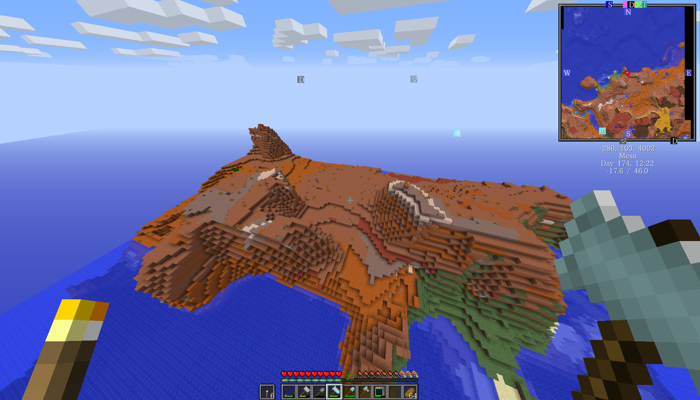
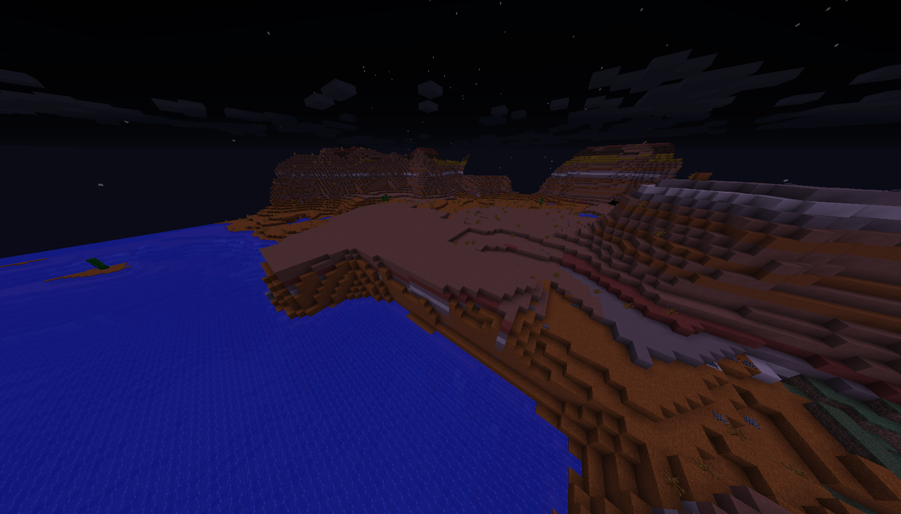
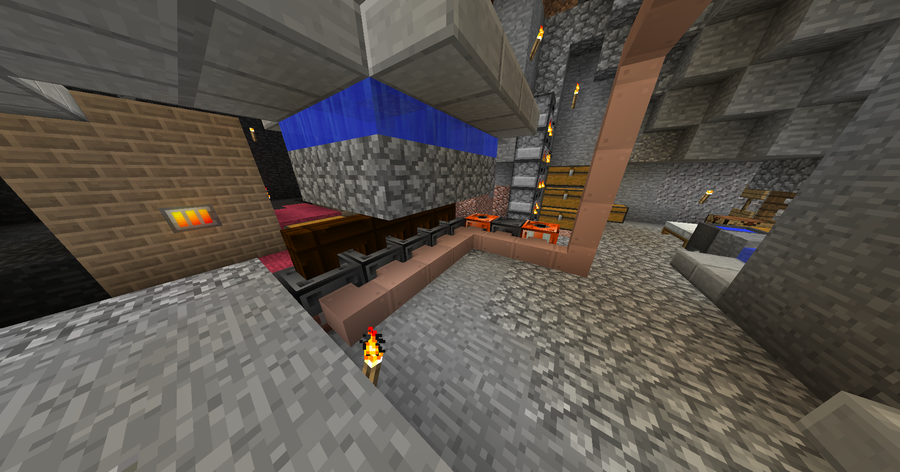
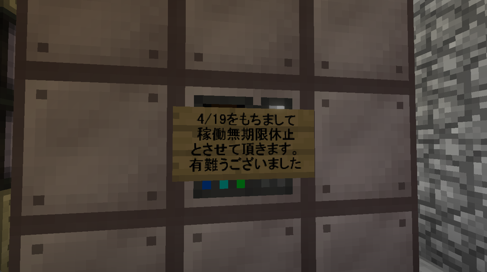
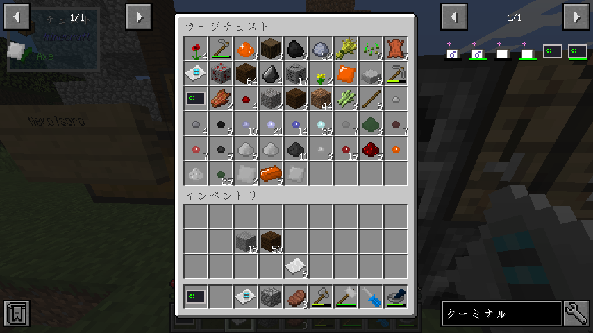

Mod Season 5 | Minecraft Forge 1.12.2 | 2022/04/10 ～ 2022/04/29

# 工業 ― Gregtech

GregTech、ちょっぴりむずかしめの工業 Mod！

エンドコンテンツ「核融合炉」までたどり着けるか？！

## Mods リスト

| Mod 名                          | バージョン                      | Mod のファイル名                                        |
| ------------------------------- | ------------------------------- | ------------------------------------------------------- |
| GregTech CE: Unofficial         | 1.12.2-2.2.0-beta               | gregtech-1.12.2-2.2.0-beta.jar                          |
| CodeChicken Lib 1.8.+           | 1.12.2-3.2.3.358                | CodeChickenLib-1.12.2-3.2.3.358-universal.jar           |
| AE2 Unofficial Extended Life    | rv6-stable-7-extended_life-v51k | appliedenergistics2-rv6-stable-7-extended_life-v51k.jar |
| AE Additions - ExtraCells2 Fork | 1.12.2-1.3.4                    | AEAdditions-1.12.2-1.3.4.jar                            |
| Shadowfacts' Forgelin           | 1.8.4                           | Forgelin-1.8.4.jar                                      |
| Volumetric Flask                | 0.18                            | volumetricflask-0.18.jar                                |
| Angel Ring To Bauble            | 1.12-0.3.1.50+d4e654e           | angelRingToBauble-1.12-0.3.1.50+d4e654e.jar             |
| Baubles                         | 1.12-1.5.2                      | Baubles-1.12-1.5.2.jar                                  |
| FTB Utilities                   | 5.4.1.131                       | FTBUtilities-5.4.1.131.jar                              |
| FTB Lib                         | 5.4.7.2                         | FTBLib-5.4.7.2.jar                                      |
| Had Enough Items (JEI)          | 1.12.2-4.18.2                   | HadEnoughItems_1.12.2-4.18.2.jar                        |
| The One Probe                   | 1.12-1.4.28                     | theoneprobe-1.12-1.4.28.jar                             |

## Mods の入れ方

---

### CurseForge

Mod 名をクリックしてリンクを踏み、Download をクリックし、5 秒待つとダウンロードが開始されます。

それぞれの Mod をダウンロードしたら mods フォルダに入れます。

#### GregTech CE: Unofficial

- [GregTech CE: Unofficial](https://www.curseforge.com/minecraft/mc-mods/gregtech-ce-unofficial/files/3736675)
- [CodeChicken Lib 1.8.+](https://www.curseforge.com/minecraft/mc-mods/codechicken-lib-1-8/files/2779848)

#### AE2 Unofficial Extended Life (Applied Energistics 2)

- [AE2 Unofficial Extended Life](https://www.curseforge.com/minecraft/mc-mods/ae2-extended-life/files/3737319)

#### Addon (AE2)

- [AE Additions - ExtraCells2 Fork](https://www.curseforge.com/minecraft/mc-mods/ae-additions-extra-cells-2-fork/files/3577829)
- [Shadowfacts' Forgelin](https://www.curseforge.com/minecraft/mc-mods/shadowfacts-forgelin/files/2785465)
- [Volumetric Flask](https://www.curseforge.com/minecraft/mc-mods/volumetric-flask/files/3008019)

#### Angel Ring To Bauble

- [Angel Ring To Bauble](https://www.curseforge.com/minecraft/mc-mods/angel-ring-to-bauble/files/2518561)
- [Baubles](https://www.curseforge.com/minecraft/mc-mods/baubles/files/2518667)

#### FTB Utilities

- [FTB Utilities](https://www.curseforge.com/minecraft/mc-mods/ftb-utilities-forge/files/3157548)
- [FTB Lib](https://www.curseforge.com/minecraft/mc-mods/ftb-library-legacy-forge/files/2985811)

#### Had Enough Items

- [Had Enough Items](https://www.curseforge.com/minecraft/mc-mods/had-enough-items/files/3687729)

#### The One Probe

- [The One Probe](https://www.curseforge.com/minecraft/mc-mods/the-one-probe/files/2667280)

---

## Gregtech の Config ファイルを追加

1. mod の入れ終わったら、一度起動しよう。
2. 起動ができたら、一度マイクラを停止して
3. このファイルをクリックしてダウンロードして、解凍しよう。
4. ダウンロードした config ファイルを上書き保存しよう。`~\config`

!!! example ""

    [Gregtech の config ファイル](https://cdn.discordapp.com/attachments/952246682874167377/962580098010189854/config.zip) (zip ファイル)

## スクリーンショット

